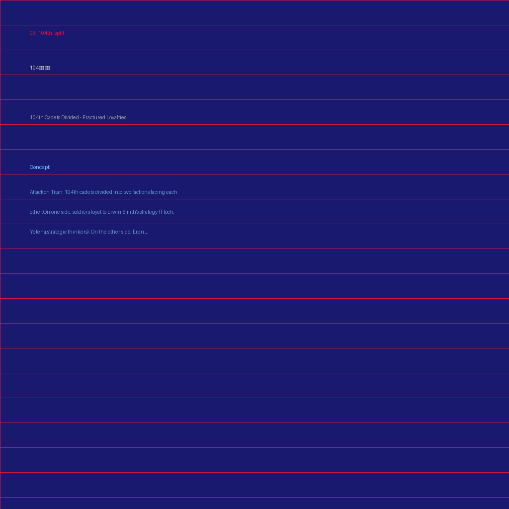

# N011: 에렌의 독자 정보 수집 — 지하실 자료의 비밀 해독

## Hypothesis
엘빈의 감정 연설 이후 내면적 결별을 확정한 에렌이, 지하실 자료 보관소에 단독 침입하여 그리샤의 암호화된 별도 기록을 해독한다. 진격의 거인의 미래 기억이 단편적으로 발현되면서 에렌은 엘빈보다 먼저 핵심 정보(좌표 발동의 절대 조건)에 도달하고, 이 정보 비대칭이 엘빈 체계와의 최종적 권력 역전의 씨앗이 된다.

## Key Events
1. 에렌이 야간에 지하실 자료 보관소에 단독 침입하여 그리샤가 암호화해둔 별도 기록을 발견한다. 기록에는 시조 거인의 좌표 발동이 왕가 혈통 거인과의 접촉 없이는 절대 불가능하다는 결정적 정보와, 그리샤 자신이 레이스 가문에서 시조 거인을 탈취할 때 경험한 도(道)의 편린이 담겨 있다. 에렌은 엘빈이 아직 도달하지 못한 이 결론에 먼저 도착한다.
2. 기록을 해독하는 과정에서 진격의 거인의 미래 기억이 촉발되어, 에렌은 "지크와의 접촉"이라는 단편적 비전을 경험한다. 비전의 내용은 불완전하지만, 지크 없이는 자신의 목적을 달성할 수 없다는 확신이 각인되며, 이는 엘빈의 대지크 전략과 독립적인 에렌만의 지크 접근 경로를 모색하게 만드는 결정적 동기가 된다.
3. 한지가 자료 보관소의 접근 기록 이상을 발견하고 에렌의 독자 접근을 엘빈에게 보고한다. 엘빈은 에렌을 즉시 구속하는 대신 "무엇을 찾으려 했는지를 알아야 대응할 수 있다"며 감시 강화를 지시하고, 한지에게 에렌이 접근한 자료의 복원 분석을 명령한다. 전략가 대 전략가의 정보전이 조사병단 내부에서 시작된다.
4. 미카사가 에렌의 야간 외출을 미행하다 같은 목적으로 에렌을 감시하던 장과 마주친다. 장은 "이건 엘빈 단장에게 보고해야 한다"고 주장하고, 미카사는 말없이 장의 앞을 가로막는다. 104기 내부에서 에렌을 둘러싼 '보호파(미카사)'와 '보고파(장)'의 분열이 가시화되며, 이는 기존의 엘빈파 vs 104기 구도와 교차하는 새로운 균열선이 된다.
5. 플로크가 에렌의 독자 행동 정보를 입수하고 밀사를 보내 협력을 제안하지만, 에렌은 "누구를 위해서가 아니라 내가 원하기 때문에 움직인다"며 일축한다. 이 거절은 역설적으로 플로크에게 에렌이 엘빈의 통제 밖에 있음을 확인시켜, 훗날 '예거파'로의 전환 가능성을 열어놓는다.

## Summary
엘빈의 감정 연설이 표면적 봉합에 그친 직후, 에렌은 내면적 결별을 행동으로 옮긴다. 야간에 지하실 자료 보관소에 단독 침입한 에렌은 그리샤가 별도로 암호화해둔 기록에서 시조 거인 좌표 발동의 절대 조건 — 왕가 혈통 거인과의 물리적 접촉 — 을 엘빈보다 먼저 확인한다. 이 과정에서 진격의 거인 특유의 미래 기억이 단편적으로 발현되어 '지크와의 접촉'이라는 비전이 에렌에게 각인되고, 엘빈의 체계와 독립적인 자신만의 지크 접근 경로를 모색하겠다는 결의가 굳어진다. 한편 한지는 보관소의 접근 흔적 이상을 포착하여 에렌의 독자 행동을 엘빈에게 보고하고, 엘빈은 즉각적 구속 대신 감시 강화와 자료 복원 분석이라는 정보전 전략을 택한다 — 전략가의 직감이 에렌을 적이 아닌 '예측해야 할 변수'로 재분류한 것이다. 에렌의 야간 행동은 미카사와 장에게도 동시에 포착되는데, 장이 보고를 주장하자 미카사는 한마디 말도 없이 그의 앞을 막아선다. 그 침묵 속의 물리적 저지가 어떤 변호보다 단호했고, 장은 그녀의 눈빛에서 일체의 협상 가능성이 없음을 읽는다. 이는 기존의 엘빈파 vs 104기 구도에 '에렌을 어떻게 할 것인가'라는 횡단적 쟁점을 추가하며 세력 구도를 삼각 이상으로 복잡화시킨다. 플로크의 협력 제안을 일축한 에렌의 "내가 원하기 때문에"라는 선언은 훗날 예거파 형성의 역설적 기원이 되며, 엘빈-에렌 간 정보 비대칭은 depth 5의 최종 대결 구도를 예비하는 결정적 전환점으로 기능한다.
